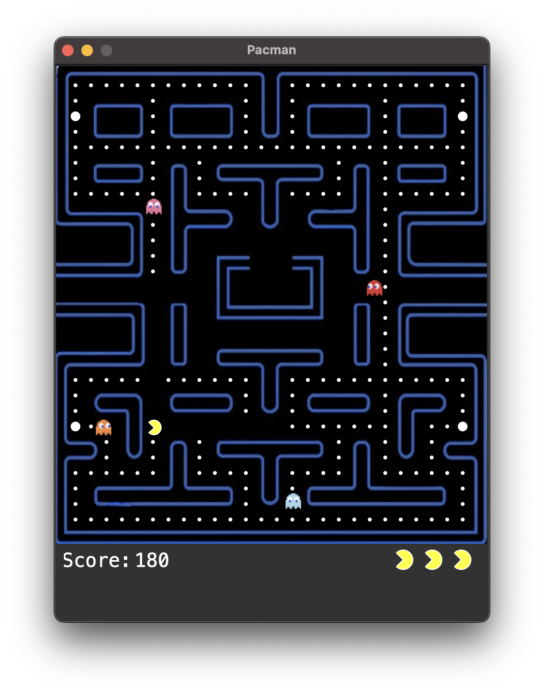

# Pacman Clone in Python

## Introduction

This is a simple clone of the classic Pacman game, developed using the Tkinter library in Python. The game involves navigating a maze, collecting pellets, and avoiding ghosts.



## Installation

1. Clone the repository
```bash
git clone https://github.com/nigelmj/pacman-python.git
cd pacman-python
```

2. Install the requirements
```bash
pip install -r requirements.txt
```

## Runnning the Game

For Linux and MacOS:
```bash
python3 pacman.py
```
For Windows
```bash
python pacman.py
```

## How to Play

- Use the wasd keys to move Pacman around the maze
- The objective is to eat all the pellets while avoiding the ghosts.
- If Pacman is caught by a ghost more than three times, the game is over.

## Menu

The game has a menu that allows you to:
- Continue a saved game
- Start a new game
- View the high scores
- Enter cheat codes
- Change the key bindings

## Controls

The default key bindings are:
- **W**: Move up
- **A**: Move left
- **S**: Move down
- **D**: Move right
- **Space**: Pause the game
- **Esc**: Boss key (fake screen)